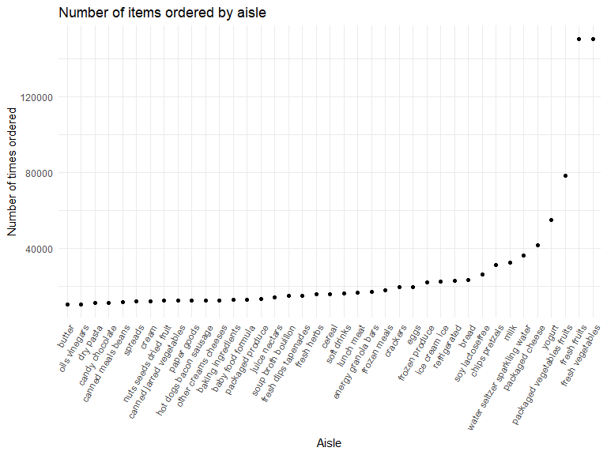
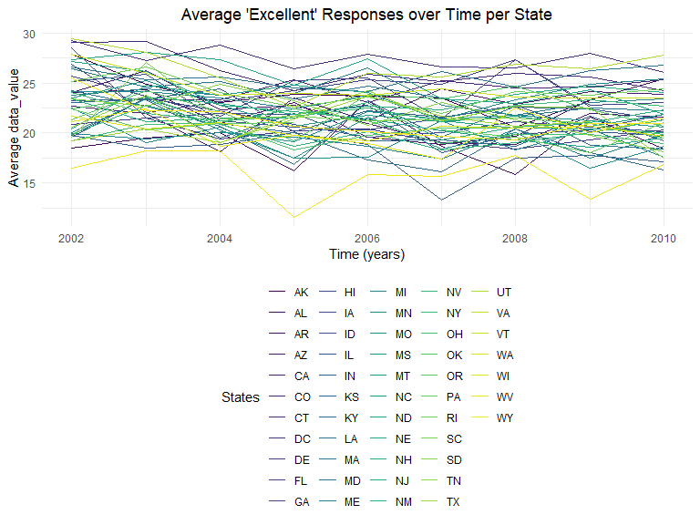
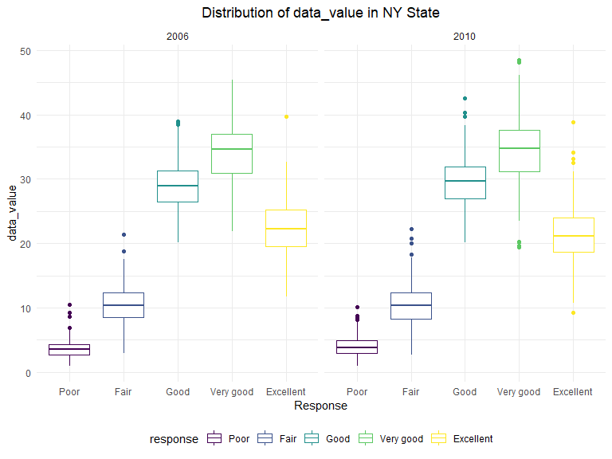
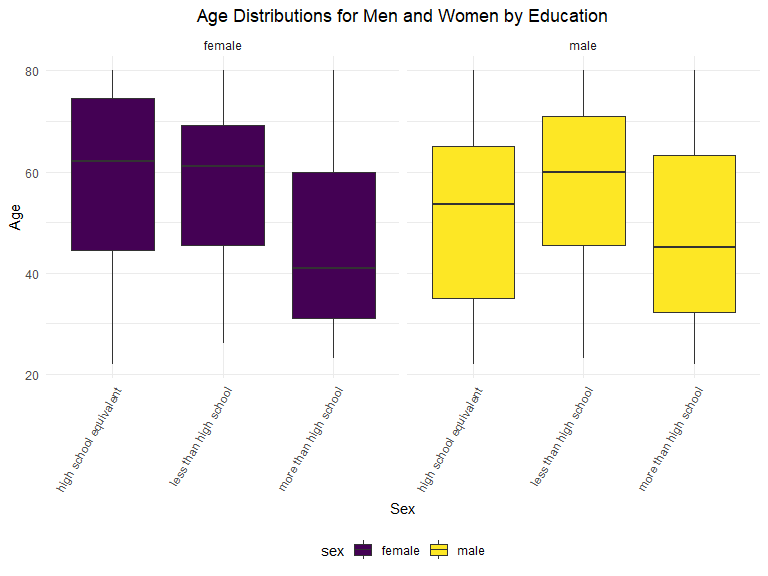
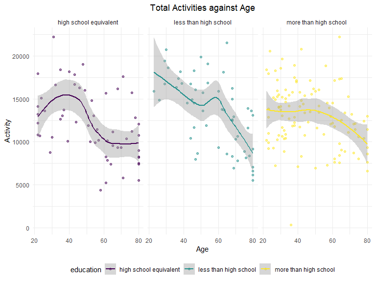
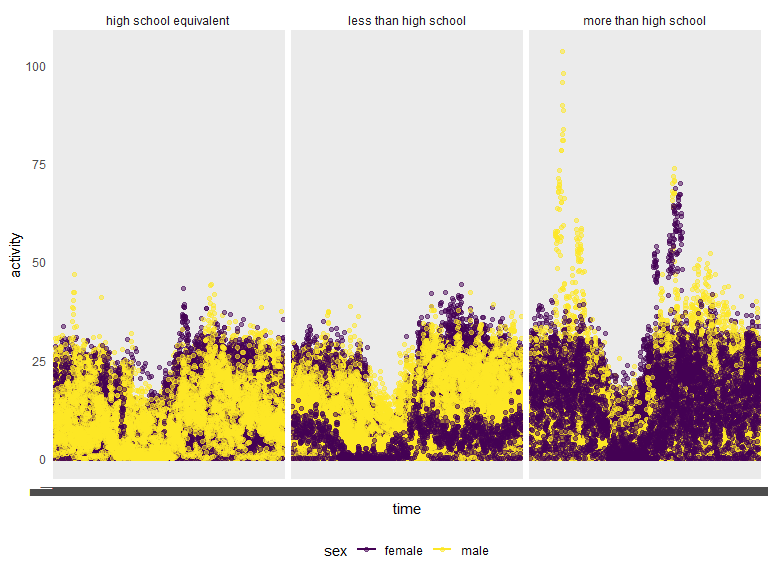

p8105_hw3_qra2000
================
Quinn Anderson
2023-10-13

## Problem 1

### Read in data

``` r
data("instacart")

instacart = 
  instacart |> 
  as_tibble()
```

### Dataset descriptions and questions

The instacart dataset is an anonymized dataset that includes data from
more than 200,000 Instacart users. The dataset has 1384617 observations
of 15 variables, where each row is a product that Instacart users can
order. Variables include identifiers for user, order, and product; the
order in which each product was added to the cart. There are several
order-level variables, describing the day and time of the order, and
number of days since prior order. There are also several item-specific
variables, describing the product name (e.g. Yogurt, Avocado),
department (e.g. dairy and eggs, produce), and aisle (e.g. yogurt, fresh
fruits), and whether the item has been ordered by this user in the past.
In total, there are 39123 products found in 131209 orders from 131209
distinct users.

The table below summarizes the number of items ordered from the aisles.
In total, there are 134 aisles, with fresh vegetables and fresh fruits
holding the most items ordered by far.

``` r
instacart |> 
  count(aisle) |> 
  arrange(desc(n))
```

    ## # A tibble: 134 × 2
    ##    aisle                              n
    ##    <chr>                          <int>
    ##  1 fresh vegetables              150609
    ##  2 fresh fruits                  150473
    ##  3 packaged vegetables fruits     78493
    ##  4 yogurt                         55240
    ##  5 packaged cheese                41699
    ##  6 water seltzer sparkling water  36617
    ##  7 milk                           32644
    ##  8 chips pretzels                 31269
    ##  9 soy lactosefree                26240
    ## 10 bread                          23635
    ## # ℹ 124 more rows

The plot below shows the number of items ordered in each aisle, limited
to aisles with more than 10,000 items ordered in this dataset.

``` r
instacart |>  
  count(aisle) |> 
  filter(n > 10000) |> 
  mutate(aisle = fct_reorder(aisle, n)) |> 
  ggplot(aes(x = aisle, y = n)) + 
  geom_point() +
  labs(
    title = "Number of items ordered by aisle",
    x = "Aisle",
    y = "Number of times ordered") +
  theme(axis.text.x = element_text(angle = 60, hjust = 1))
```



The table below shows the 3 most popular items in each of the aisles:
`baking ingredients`, `dog food care`, and `packaged vegetable fruits`,
and the number of times each item is ordered.

``` r
instacart |> 
  filter(
    aisle %in% c("baking ingredients", "dog food care", "packaged vegetables fruits")) |>
  group_by(aisle) |> 
  count(product_name) |> 
  mutate(rank = min_rank((desc(n)))) |> 
  filter(rank < 4) |> 
  arrange(desc(n)) |> 
  knitr::kable()
```

| aisle                      | product_name                                  |    n | rank |
|:---------------------------|:----------------------------------------------|-----:|-----:|
| packaged vegetables fruits | Organic Baby Spinach                          | 9784 |    1 |
| packaged vegetables fruits | Organic Raspberries                           | 5546 |    2 |
| packaged vegetables fruits | Organic Blueberries                           | 4966 |    3 |
| baking ingredients         | Light Brown Sugar                             |  499 |    1 |
| baking ingredients         | Pure Baking Soda                              |  387 |    2 |
| baking ingredients         | Cane Sugar                                    |  336 |    3 |
| dog food care              | Snack Sticks Chicken & Rice Recipe Dog Treats |   30 |    1 |
| dog food care              | Organix Chicken & Brown Rice Recipe           |   28 |    2 |
| dog food care              | Small Dog Biscuits                            |   26 |    3 |

The table below shows the mean hour of the day at which Pink Lady Apples
and Coffee Ice Cream are ordered on each day of the week. The table has
been formatted for human readers. Pink lady apples are typically ordered
earlier in the day than Coffee Ice Cream (~11am) with the exception of
day 5.

``` r
instacart |> 
  filter(
    product_name %in% c("Pink Lady Apples", "Coffee Ice Cream")) |> 
  group_by(product_name, order_dow) |> 
  summarize(mean_hour = mean(order_hour_of_day)) |> 
  pivot_wider(
    names_from = order_dow,
    values_from = mean_hour) |> 
  knitr::kable(digits = 2)
```

    ## `summarise()` has grouped output by 'product_name'. You can override using the
    ## `.groups` argument.

| product_name     |     0 |     1 |     2 |     3 |     4 |     5 |     6 |
|:-----------------|------:|------:|------:|------:|------:|------:|------:|
| Coffee Ice Cream | 13.77 | 14.32 | 15.38 | 15.32 | 15.22 | 12.26 | 13.83 |
| Pink Lady Apples | 13.44 | 11.36 | 11.70 | 14.25 | 11.55 | 12.78 | 11.94 |

## Problem 2

### Read in data

``` r
data("brfss_smart2010")
```

### Data cleaning

``` r
brfss_smart2010_clean =
  brfss_smart2010 |> 
  janitor::clean_names() |>
  filter(topic == "Overall Health",
         response %in% c("Excellent", "Very good", "Good", "Fair", "Poor")) |> 
  mutate(response = factor(response, levels = c("Poor", "Fair", "Good", "Very good", "Excellent"), ordered = TRUE)) |>
  rename("state" = "locationabbr","county" = "locationdesc")
```

### Data discussion

``` r
brfss_smart2010_clean |> 
  filter(year == "2002") |> 
  group_by(year, state) |> 
  summarize(nloc = n_distinct(geo_location)) |> 
  filter(nloc >= 7) |>
  arrange(desc(nloc)) |> 
  knitr::kable()
```

    ## `summarise()` has grouped output by 'year'. You can override using the
    ## `.groups` argument.

| year | state | nloc |
|-----:|:------|-----:|
| 2002 | PA    |   10 |
| 2002 | MA    |    8 |
| 2002 | NJ    |    8 |
| 2002 | CT    |    7 |
| 2002 | FL    |    7 |
| 2002 | NC    |    7 |

``` r
brfss_smart2010_clean |> 
  filter(year == "2010") |> 
  group_by(year, state) |> 
  summarize(nloc = n_distinct(geo_location)) |> 
  filter(nloc >= 7) |> 
  arrange(desc(nloc)) |> 
  knitr::kable()
```

    ## `summarise()` has grouped output by 'year'. You can override using the
    ## `.groups` argument.

| year | state | nloc |
|-----:|:------|-----:|
| 2010 | FL    |   41 |
| 2010 | NJ    |   19 |
| 2010 | TX    |   16 |
| 2010 | CA    |   12 |
| 2010 | MD    |   12 |
| 2010 | NC    |   12 |
| 2010 | NE    |   10 |
| 2010 | WA    |   10 |
| 2010 | MA    |    9 |
| 2010 | NY    |    9 |
| 2010 | OH    |    8 |
| 2010 | CO    |    7 |
| 2010 | PA    |    7 |
| 2010 | SC    |    7 |

In 2002, there were 6 states were observed at 7 or more locations: PA,
MA, NJ, CT, FL, NC.

In 2010, 14 states were observed at 7 or more locations: FL, NJ, TX, CA,
MD, NC, NE, WA, MA, NY, OH, CO, PA, SC.

Construct a dataset that is limited to `Excellent` responses, and
contains, `year`, `state`, and a variable that averages the `data_value`
across locations within a state. Make a “spaghetti” plot of this average
value over time within a state (that is, make a plot showing a line for
each state across years – the geom_line geometry and group aesthetic
will help).

``` r
bfrss_smart2010_excellent =
  brfss_smart2010_clean |> 
  filter(response == "Excellent") |> 
  select(year, state, county, data_value) |> 
  group_by(year, state) |> 
  summarize(mean_dv = mean(data_value))
```

    ## `summarise()` has grouped output by 'year'. You can override using the
    ## `.groups` argument.

``` r
bfrss_smart2010_excellent |>
  ggplot(aes(x = year, y = mean_dv, group = state)) + 
  geom_line(aes(color = state)) + 
  labs(
    title = "Average 'Excellent' Responses over Time per State",
    x = "Time (years)",
    y = "Average data_value",
    color = "States") +
  theme(plot.title = element_text(hjust = 0.5))
```



Make a two-panel plot showing, for the years 2006, and 2010,
distribution of data_value for responses (“Poor” to “Excellent”) among
locations in NY State.

``` r
brfss_smart2010_clean |> 
  filter(year %in% c("2006", "2010", state == "NY")) |> 
  select(year, state, county, response, data_value) |> 
  ggplot(aes(x = response, y = data_value, color = response)) +
  geom_boxplot() +
  facet_grid(.~ year) +
  labs(
    title = "Distribution of data_value in NY State",
    x = "Response",
    y = "data_value") +
  theme(plot.title = element_text(hjust = 0.5))
```



## Problem 3

### Read in, clean, tidy, and merge datasets

Read in and clean NHANES demographic data

``` r
nhanes_covar = 
  read_csv("./data/nhanes_covar.csv", skip = 4)
```

    ## Rows: 250 Columns: 5
    ## ── Column specification ────────────────────────────────────────────────────────
    ## Delimiter: ","
    ## dbl (5): SEQN, sex, age, BMI, education
    ## 
    ## ℹ Use `spec()` to retrieve the full column specification for this data.
    ## ℹ Specify the column types or set `show_col_types = FALSE` to quiet this message.

``` r
nhanes_covar_clean =
  nhanes_covar |> 
  janitor::clean_names() |> 
  mutate(
    sex = recode(sex, `1` = "male", `2` = "female"),
    education = recode(education, `1` = "less than high school", `2` = "high school equivalent", `3` = "more than high school")) |> 
  drop_na(bmi, education) |> 
  filter(age > 21)
```

Read and clean NHANES accelerometer data.

``` r
nhanes_accel = 
  read_csv("./data/nhanes_accel.csv")
```

    ## Rows: 250 Columns: 1441
    ## ── Column specification ────────────────────────────────────────────────────────
    ## Delimiter: ","
    ## dbl (1441): SEQN, min1, min2, min3, min4, min5, min6, min7, min8, min9, min1...
    ## 
    ## ℹ Use `spec()` to retrieve the full column specification for this data.
    ## ℹ Specify the column types or set `show_col_types = FALSE` to quiet this message.

``` r
nhanes_accel_clean = nhanes_accel |> 
  janitor::clean_names() |> 
  drop_na()
```

Combine both datasets.

``` r
nhanes_data = merge(nhanes_covar_clean, nhanes_accel_clean)
```

### Data table and visualization, preliminary exploration

Produce reader friendly table for the number of men and women in each
education category, and create a visualization of the age distributions
for men and women in each education category.

``` r
nhanes_gender_education =
  nhanes_data |> 
  group_by(sex, education) |> 
  summarize(count = n()) |> 
  pivot_wider(
    names_from = "sex",
    values_from = "count") |> 
  knitr::kable()
```

    ## `summarise()` has grouped output by 'sex'. You can override using the `.groups`
    ## argument.

``` r
ggplot(nhanes_data, aes(x = education, y = age, fill = sex)) + 
  geom_boxplot() +
  facet_grid(. ~ sex) +
  labs(
    title = "Age Distributions for Men and Women by Education",
    x = "Sex",
    y = "Age",
    color = "Sex") +
  theme(
    plot.title = element_text(hjust = 0.5),
    axis.text.x = element_text(angle = 60, hjust = 1))
```



The plot above shows the age distribution by education category among
the 250 total male and female participants in the NHANES study. The plot
above shows the majority of the younger participants in the study across
both male and females have an education more than high school, although
slightly more female participants have education beyond high school.

### Data analyses

#### Total activity over the day

Using tidied dataset, aggregate across minutes to create “total
activity” variable for each participant. Plot activities (y-axis)
against age (x-axis).

``` r
nhanes_data |> 
  group_by(education, sex) |> 
  mutate(total_activity = rowSums(across(min1:min1440))) |> 
  ggplot(aes(x = age, y = total_activity, color = education)) +
  geom_point(alpha = .5) +
  facet_wrap(~education) +
  geom_smooth()+
  labs(
    title = "Total Activities against Age",
    x = "Age",
    y = "Activity") +
  theme(plot.title = element_text(hjust = 0.5))
```

    ## `geom_smooth()` using method = 'loess' and formula = 'y ~ x'



The plot above shows the total activities compared to participant age
from data in the NHANES study, separated by education level. This plot
shows that total activity decreases as age increases across all three
education levels. Participants wtih education less than high school have
the highest total activities at the youngest age (20), then sharply
decreases to the lowest total activities at the highest age (80). For
participants with an education of high school equivalent, the highest
total activity is among participants around 40 years old. For
participants with an education beyond high school, the total activity
plateaus for ages 20-40, then declines after age 60.

#### Inspection activity over the course of the day

Make a three-panel plot that shows the 24-hour activity time courses for
each education level and use color to indicate sex.

``` r
nhanes_data |> 
  pivot_longer(
    min1:min1440,
    names_to = "time", 
    values_to = "activity") |> 
  ggplot(aes(x = time, y = activity, color = sex)) +
  geom_point(alpha = .5) +
  geom_smooth(se = FALSE) +
  facet_grid(.~ education) +
  labs(
    title = "24-hour activity time course for each education level across sex",
    x = "Time (minutes)",
    y = "Activity") +
  theme(plot.title = element_text(hjust = 0.5))
```

    ## `geom_smooth()` using method = 'loess' and formula = 'y ~ x'



This plot shows the 24-hour activity time courses for male and female
participants of the NHANES study across education level. The plot shows
that male participants with education more than high school have the
highest 24-total activity, followed by female participants with
education more than high school. From this we can conclude the

Describe in words any patterns or conclusions you can make based on this
graph; including smooth trends may help identify differences.
