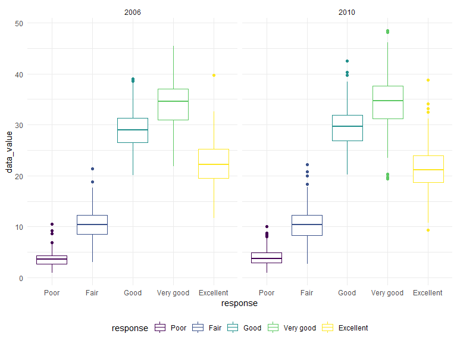

p8105_hw3_qra2000
================
Quinn Anderson
2023-10-12

## Problem 1

### Read in data

``` r
data("instacart")

instacart = 
  instacart |> 
  as_tibble()
```

### Dataset descriptions and questions

The instacart dataset is an anonymized dataset that includes data from
more than 200,000 Instacart users. The dataset has 1384617 observations
of 15 variables, where each row is a product that Instacart users can
order. Variables include identifiers for user, order, and product; the
order in which each product was added to the cart. There are several
order-level variables, describing the day and time of the order, and
number of days since prior order. There are also several item-specific
variables, describing the product name (e.g. Yogurt, Avocado),
department (e.g. dairy and eggs, produce), and aisle (e.g. yogurt, fresh
fruits), and whether the item has been ordered by this user in the past.
In total, there are 39123 products found in 131209 orders from 131209
distinct users.

The table below summarizes the number of items ordered from the aisles.
In total, there are 134 aisles, with fresh vegetables and fresh fruits
holding the most items ordered by far.

``` r
instacart |> 
  count(aisle) |> 
  arrange(desc(n))
```

    ## # A tibble: 134 × 2
    ##    aisle                              n
    ##    <chr>                          <int>
    ##  1 fresh vegetables              150609
    ##  2 fresh fruits                  150473
    ##  3 packaged vegetables fruits     78493
    ##  4 yogurt                         55240
    ##  5 packaged cheese                41699
    ##  6 water seltzer sparkling water  36617
    ##  7 milk                           32644
    ##  8 chips pretzels                 31269
    ##  9 soy lactosefree                26240
    ## 10 bread                          23635
    ## # ℹ 124 more rows

The plot below shows the number of items ordered in each aisle, limited
to aisles with more than 10,000 items ordered in this dataset.

``` r
instacart |>  
  count(aisle) |> 
  filter(n > 10000) |> 
  mutate(aisle = fct_reorder(aisle, n)) |> 
  ggplot(aes(x = aisle, y = n)) + 
  geom_point() +
  labs(
    title = "Number of items ordered by aisle",
    x = "Aisle",
    y = "Number of times ordered") +
  theme(axis.text.x = element_text(angle = 60, hjust = 1))
```


The table below shows the 3 most popular items in each of the aisles:
`baking ingredients`, `dog food care`, and `packaged vegetable fruits`,
and the number of times each item is ordered.

``` r
instacart |> 
  filter(
    aisle %in% c("baking ingredients", "dog food care", "packaged vegetables fruits")) |>
  group_by(aisle) |> 
  count(product_name) |> 
  mutate(rank = min_rank((desc(n)))) |> 
  filter(rank < 4) |> 
  arrange(desc(n)) |> 
  knitr::kable()
```

| aisle                      | product_name                                  |    n | rank |
|:---------------------------|:----------------------------------------------|-----:|-----:|
| packaged vegetables fruits | Organic Baby Spinach                          | 9784 |    1 |
| packaged vegetables fruits | Organic Raspberries                           | 5546 |    2 |
| packaged vegetables fruits | Organic Blueberries                           | 4966 |    3 |
| baking ingredients         | Light Brown Sugar                             |  499 |    1 |
| baking ingredients         | Pure Baking Soda                              |  387 |    2 |
| baking ingredients         | Cane Sugar                                    |  336 |    3 |
| dog food care              | Snack Sticks Chicken & Rice Recipe Dog Treats |   30 |    1 |
| dog food care              | Organix Chicken & Brown Rice Recipe           |   28 |    2 |
| dog food care              | Small Dog Biscuits                            |   26 |    3 |

The table below shows the mean hour of the day at which Pink Lady Apples
and Coffee Ice Cream are ordered on each day of the week. The table has
been formatted for human readers. Pink lady apples are typically ordered
earlier in the day than Coffee Ice Cream (~11am) with the exception of
day 5.

``` r
instacart |> 
  filter(
    product_name %in% c("Pink Lady Apples", "Coffee Ice Cream")) |> 
  group_by(product_name, order_dow) |> 
  summarize(mean_hour = mean(order_hour_of_day)) |> 
  pivot_wider(
    names_from = order_dow,
    values_from = mean_hour) |> 
  knitr::kable(digits = 2)
```

    ## `summarise()` has grouped output by 'product_name'. You can override using the
    ## `.groups` argument.

| product_name     |     0 |     1 |     2 |     3 |     4 |     5 |     6 |
|:-----------------|------:|------:|------:|------:|------:|------:|------:|
| Coffee Ice Cream | 13.77 | 14.32 | 15.38 | 15.32 | 15.22 | 12.26 | 13.83 |
| Pink Lady Apples | 13.44 | 11.36 | 11.70 | 14.25 | 11.55 | 12.78 | 11.94 |

## Problem 2

### Read in data

``` r
data("brfss_smart2010")

brfss_smart2010 = 
  brfss_smart2010 |> 
  as_tibble()
```

### Data cleaning

``` r
brfss_smart2010_clean = brfss_smart2010 |> 
  janitor::clean_names() |>
  filter(topic == "Overall Health",
         response %in% c("Excellent", "Very good", "Good", "Fair", "Poor")) |> 
  mutate(response = factor(response, levels = c("Poor", "Fair", "Good", "Very good", "Excellent"), ordered = TRUE)) |>
  rename("state" = "locationabbr","county" = "locationdesc")

view(brfss_smart2010_clean)
```

### Data discussion

In 2002, 6 states were observed at 7 or more locations: PA, NJ, NC, MA,
FL, and CT.

``` r
states_2002 =
  brfss_smart2010_clean |> 
  filter(year == "2002") |> 
  group_by(year, state) |> 
  summarize(nlocation = n_distinct(geo_location)) |> 
  filter(nlocation >= 7) |> 
  knitr::kable()
```

    ## `summarise()` has grouped output by 'year'. You can override using the
    ## `.groups` argument.

``` r
states_2002
```

| year | state | nlocation |
|-----:|:------|----------:|
| 2002 | CT    |         7 |
| 2002 | FL    |         7 |
| 2002 | MA    |         8 |
| 2002 | NC    |         7 |
| 2002 | NJ    |         8 |
| 2002 | PA    |        10 |

In 2010, 14 states were observed at 7 or more locations: CA, CO, FL, MA,
MD, NC, NE, NJ, NY, OH, PA, SC, TX, WA.

``` r
states_2010 = 
  brfss_smart2010_clean |> 
  filter(year == "2010") |> 
  group_by(year, state) |> 
  summarize(nloc = n_distinct(geo_location)) |> 
  filter(nloc >= 7) |> 
  knitr::kable()
```

    ## `summarise()` has grouped output by 'year'. You can override using the
    ## `.groups` argument.

``` r
states_2010
```

| year | state | nloc |
|-----:|:------|-----:|
| 2010 | CA    |   12 |
| 2010 | CO    |    7 |
| 2010 | FL    |   41 |
| 2010 | MA    |    9 |
| 2010 | MD    |   12 |
| 2010 | NC    |   12 |
| 2010 | NE    |   10 |
| 2010 | NJ    |   19 |
| 2010 | NY    |    9 |
| 2010 | OH    |    8 |
| 2010 | PA    |    7 |
| 2010 | SC    |    7 |
| 2010 | TX    |   16 |
| 2010 | WA    |   10 |

Construct a dataset that is limited to `Excellent` responses, and
contains, `year`, `state`, and a variable that averages the `data_value`
across locations within a state. Make a “spaghetti” plot of this average
value over time within a state (that is, make a plot showing a line for
each state across years – the geom_line geometry and group aesthetic
will help).

``` r
bfrss_smart2010_excellent = brfss_smart2010_clean |> 
  filter(response == "Excellent") |> 
  select(year, state, county, data_value) |> 
  group_by(year, state) |> 
  summarize(mean_dv = mean(data_value))
```

    ## `summarise()` has grouped output by 'year'. You can override using the
    ## `.groups` argument.

``` r
bfrss_smart2010_excellent |>
  ggplot(aes(x = year, y = mean_dv, group = state)) + 
  geom_line(aes(color = state)) + 
  labs(
    title = "Average 'Excellent' Responses over Time per State",
    x = "Time (years)",
    y = "Mean (percentage)",
    color = "States", 
    caption = "Data from bfrss_smart_2010 dataset") +
  theme(plot.title = element_text(hjust = 0.5))
```


Make a two-panel plot showing, for the years 2006, and 2010,
distribution of data_value for responses (“Poor” to “Excellent”) among
locations in NY State.

``` r
brfss_smart2010_clean |> 
   mutate(response = forcats::fct_relevel(response, c("Poor", "Fair", "Excellent", "Good", "Very good"))) |> 
  filter(year %in% c("2006", "2010", state == "NY")) |> 
  select(year, state, county, response, data_value) |> 
  ggplot(aes(x = response, y = data_value, color = response)) +
  geom_boxplot() +
  facet_grid(.~ year)
```



This two-panel boxplot shows that for 2006 and 2010, the distribution of
data_value for responses (“Poor” to Excellent”) among locations in NY
state are mostly “Good” and “Very good”. In 2010, the responses for
“Good” and “Very good” increased from 2006, and have more outliers.

## Problem 3

### Read in data

### Data cleaning
